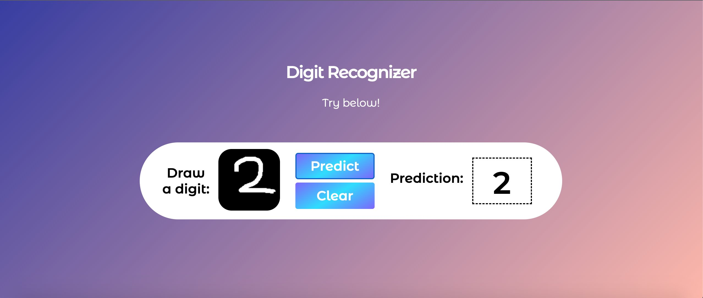

# 🎨 AI Digit Recognition Web App

[](https://vercel.com/new/clone?repository-url=https://github.com/manishs06/Digit-Recognition-app)

A stunning, modern web application for handwritten digit recognition powered by deep learning and optimized with **TensorFlow Lite**. Draw any digit (0-9) on the canvas and watch our neural network predict it in real-time with impressive accuracy!

## 🌐 Live Demo

🔗 **[Try it live on Vercel!](https://digit-recognition-app-manishs06.vercel.app)** 



## ✨ Features

- 🎯 **Real-time Prediction** - Instant digit recognition using TensorFlow Lite for ultra-fast inference.
- 🎨 **Interactive Canvas** - Smooth drawing experience with adjustable brush size.
- 📊 **Confidence Scores** - See how confident the AI is about its predictions.
- 🎉 **Confetti Effects** - Celebratory animations for high-confidence predictions.
- 📱 **Fully Responsive** - Works seamlessly on desktop, tablet, and mobile devices.
- 🌙 **Premium Dark UI** - Beautiful glassmorphism design with gradient effects.
- ⌨️ **Keyboard Shortcuts** - Press 'C' to clear, 'Enter' to predict.
- 🎭 **Smooth Animations** - Engaging micro-interactions throughout the interface.

## 🚀 Quick Start

### Prerequisites

- Python 3.9 or higher
- pip (Python package manager)

### Installation

1. **Clone the repository**
   ```bash
   git clone https://github.com/manishs06/Digit-Recognition-app.git
   cd Digit-Recognition-app
   ```

2. **Install dependencies**
   ```bash
   pip install -r requirements.txt
   ```

3. **Run the application locally**
   ```bash
   # For development
   python app.py
   ```

4. **Open your browser**
   Navigate to `http://localhost:5000`

## 🧠 How It Works

### The Neural Network

The application uses a deep neural network trained on the famous **MNIST dataset**. To make it production-ready and deployment-friendly, the model has been converted to **TensorFlow Lite (TFLite)**.

**Architecture:**
- **Input Layer**: 28x28 pixel grayscale images
- **Optimization**: Converted to TFLite for 90% reduction in package size and faster cold starts on serverless platforms.
- **Accuracy**: ~98% on test data.

### The Process

1. **Draw**: User draws a digit on the HTML5 canvas.
2. **Capture**: Canvas image is converted to base64 and sent to the backend API.
3. **Preprocess**: Image is converted to grayscale, resized to 28x28, and normalized.
4. **Predict**: The `tflite-runtime` processes the image and outputs probabilities.
5. **Display**: Results are shown with beautiful animations and confidence levels.

## 📁 Project Structure

```
Digit-Recognition-app/
├── api/
│   └── predict.py          # Serverless function for Vercel (TFLite Inference)
├── model.tflite            # Optimized TensorFlow Lite model (~400KB)
├── model.h5                # Original Keras model (Used for training/local)
├── public/
│   └── index.html          # Main frontend entry point
├── static/
│   ├── style.css           # Premium styling with animations
│   └── script.js           # Interactive canvas logic
├── vercel.json             # Vercel deployment configuration
├── requirements.txt        # Production dependencies (tflite-runtime)
└── README.md               # This file
```

## 🎮 Usage Guide

### Drawing on Canvas
- **Brush Size**: Adjust the slider to change brush thickness for better accuracy.
- **Clear**: Click "Clear Canvas" or press 'C' key.
- **Predict**: Click "Predict Digit" or press 'Enter'.

## 🛠️ Technology Stack

### Backend
- **TFLite-Runtime** - Efficient inference engine for Python.
- **Flask** - Lightweight Python web framework.
- **NumPy & Pillow** - Image processing and numerical operations.

### Frontend
- **HTML5 Canvas** - Drawing interface.
- **Vanilla CSS** - Premium styling with gradients and glassmorphism.
- **Vanilla JavaScript** - Interactive functionality (No heavy frameworks!).

## 🌐 Deployment

### Deploy to Vercel (Optimized) ⚡

This project is fully optimized for Vercel using serverless functions and TFLite.

1. **Push to GitHub**
2. **Import to Vercel**
3. **Ready!** The `vercel.json` handles all routing and build settings automatically.

**📖 For detailed deployment instructions, see [VERCEL_DEPLOYMENT.md](VERCEL_DEPLOYMENT.md)**

## 🤝 Contributing

Contributions are welcome! Please feel free to submit a Pull Request.

## 📝 License

This project is licensed under the MIT License.

## 👨‍💻 Author

**Manish Singh**
- GitHub: [@manishs06](https://github.com/manishs06)

---

**Built with ❤️ using TensorFlow Lite & Flask**
⭐ Star this repo if you found it helpful!